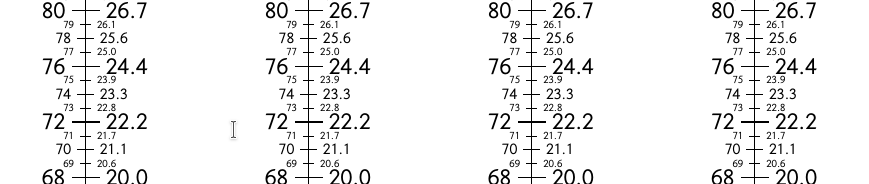

# Farenheit-Celsius

A Farenheit-Celsius coversion numberline made using LaTeX. 

- Convert between Celsius - Farenheit temperature scales.
- 4 identical numberlines reduce waste in printing.
- Uses `standalone` package.

Partial Screenshot:

Copyright © 2018-2019 Prashant Meckoni

